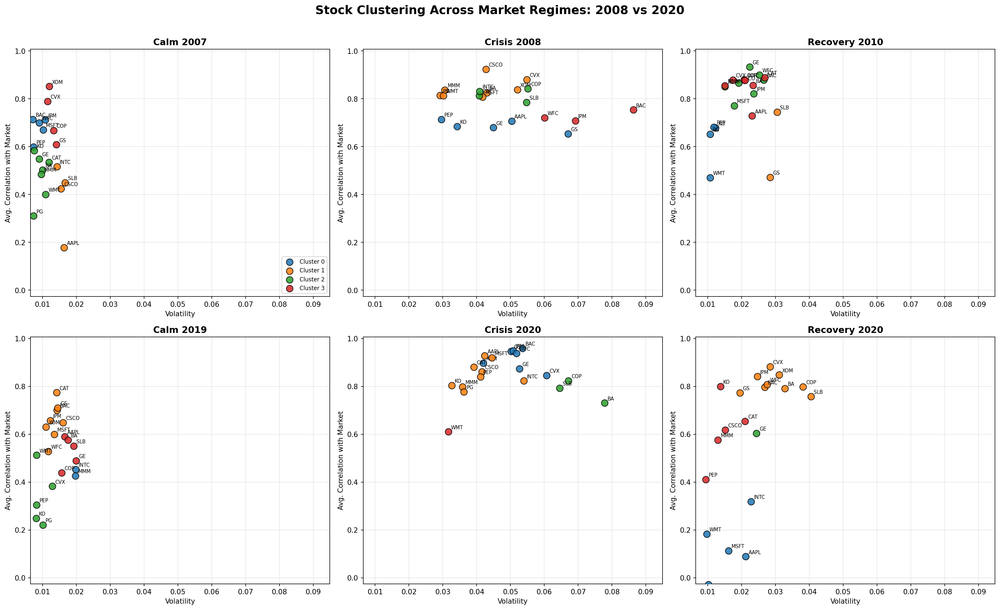
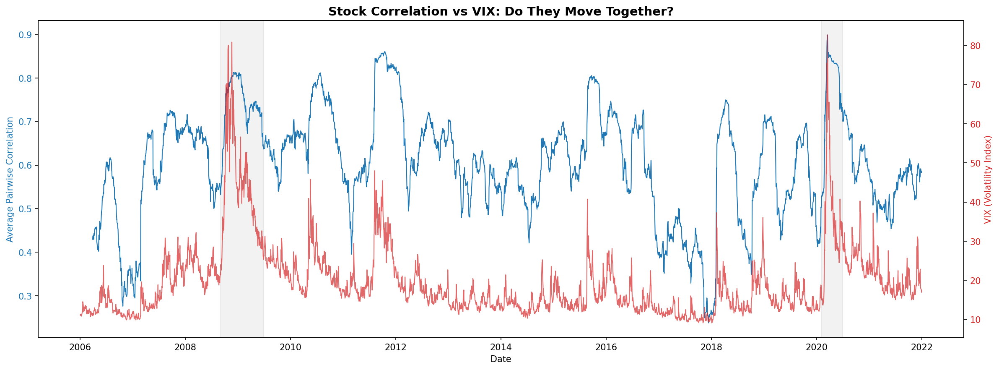

# Stock Clustering & Financial Crisis Detection

Unsupervised clustering of 20 S&P 500 large-cap stocks to detect systemic
risk signals during the 2008 Global Financial Crisis and the 2020 COVID
crash — using rolling volatility, returns, and correlation as features,
K-means clustering, and validation against the VIX.

## Key Finding

A simple, interpretable metric — the 60-day rolling average pairwise
correlation across 20 stocks spanning five sectors — spiked sharply and
consistently during both crises studied:

| Period | Correlation | vs. Calm Baseline (0.484) |
|---|---|---|
| 2008 GFC peak (Dec 1, 2008) | 0.813 | +67.9% |
| 2020 COVID peak (Mar 16, 2020) | 0.899 | +85.6% |

This metric also showed a **0.604 correlation with the VIX** (CBOE
Volatility Index) across 3,967 matched trading days from 2006-2021,
providing independent validation that it captures genuine market-wide
stress rather than a modeling artifact.

At the stock level: in the calm 2007 period, the three major banks in this
dataset (BAC, JPM, WFC) were **not** grouped together by K-means clustering.
By the peak of the 2008 crisis, they formed a distinct, high-volatility
cluster of their own — separated from every other stock, without being told
sector labels. The cluster the algorithm isolated was, in fact, the sector
at the actual epicenter of that crisis.





## Methodology

1. **Data**: Daily closing prices for 20 US large-cap stocks across 5
   sectors (Financials, Technology, Energy, Consumer Staples, Industrials),
   2006-2021, via `yfinance`.
2. **Features**: 60-day rolling volatility, mean return, and average
   pairwise correlation, computed daily for each stock.
3. **Clustering**: K-means (k=4, selected via elbow method and silhouette
   analysis) applied to standardized features at six snapshot dates spanning
   calm, crisis, and recovery periods for both crises.
4. **Validation**: A continuous market-wide correlation signal (average of
   the correlation feature across all 20 stocks, every trading day) compared
   against the VIX as an independent, industry-standard benchmark.

Full methodology and design decisions are documented in the notebooks under
`notebooks/`, and the academic context for this approach is discussed in
[`docs/literature_review.md`](docs/literature_review.md).

## Project Structure

```
├── data/                          # Raw and processed price/feature data
├── notebooks/                     # Analysis notebooks
│   └── full_analysis.ipynb
├── outputs/                       # Clustering results and summary statistics
│   └── figures/                   # Saved visualizations
├── docs/
│   └── literature_review.md       # Academic context and related work
└── README.md
```

## Limitations & Future Work

This project is a proof-of-concept replication of a well-documented
phenomenon (correlation convergence during crises), applied to a small,
US-only, large-cap dataset using a single clustering method. It is not a
novel research contribution. See
[`docs/literature_review.md`](docs/literature_review.md) for a discussion
of how this could be extended — including benchmarking against alternative
clustering methods, statistical significance testing, a broader dataset,
and a genuinely predictive (rather than descriptive) framing.

## Reproducing This Project

1. Clone this repository
2. Open `notebooks/full_analysis.ipynb` in Google Colab or Jupyter
3. Install dependencies: `pip install yfinance pandas scikit-learn matplotlib`
4. Run cells in order — the notebook re-downloads price data via `yfinance`,
   so results are fully reproducible from scratch

## Author

Shubhendu Mondal — [GitHub](https://github.com/shubmondal)

Built as a pre-MSc portfolio project ahead of an MSc in Data Science,
exploring the intersection of financial analytics and unsupervised
machine learning.
